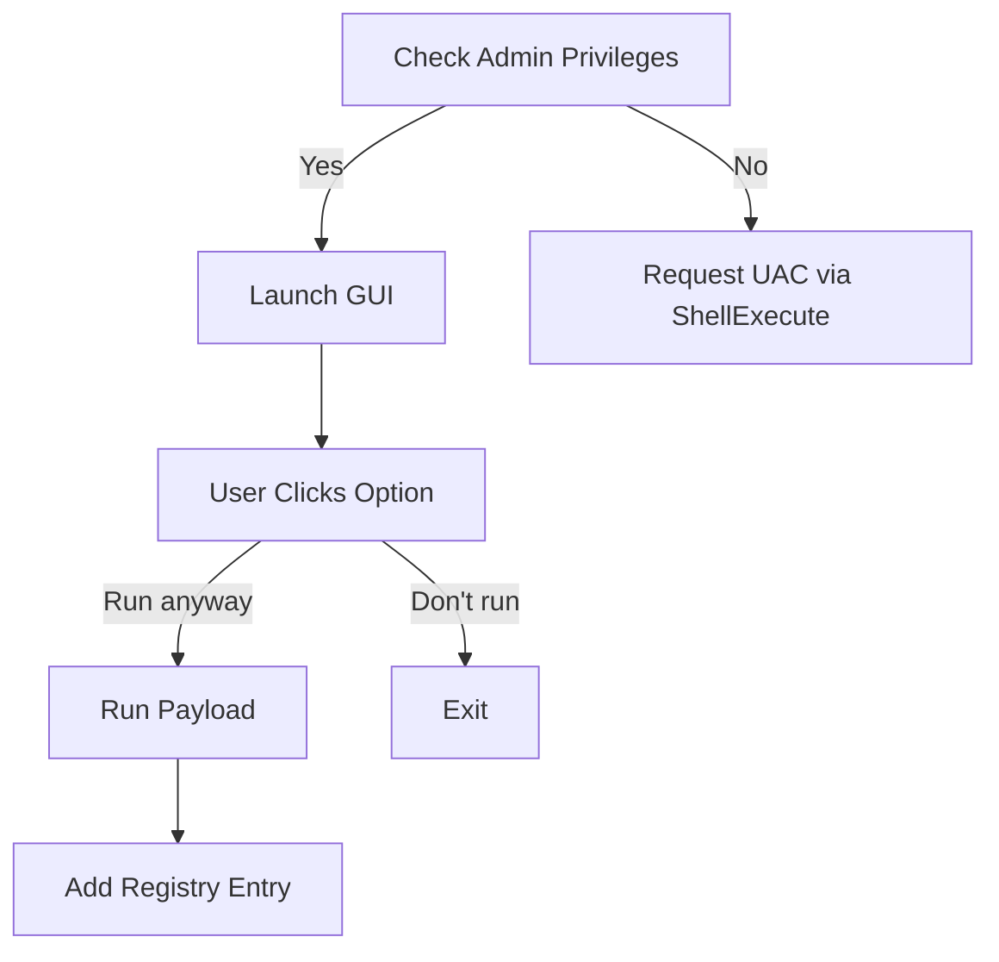

# 🛡️ Windows Defender SmartScreen Simulator  
**Version 1.0** | Developed by [Shiboshree Roy](https://github.com/shiboshreeroy)

> ⚠️ **Disclaimer**: This project is for **educational and demonstration purposes only**. It must only be executed on systems **you own or have explicit permission to test**. The developer is **not responsible** for any misuse or damage caused by the code.

---

## 📘 Overview

This Python script simulates the **Microsoft Defender SmartScreen** warning window using `tkinter`. The project is meant to demonstrate how social engineering, UI spoofing, and persistence mechanisms could be visually represented — for **security research**, **user awareness training**, or **ethical demonstrations**.

When executed, it:

- Requests admin privileges (via UAC)
- Displays a realistic SmartScreen UI overlay
- Executes a payload if the user chooses "Run anyway"
- Adds a persistent entry in the Windows Registry (`HKCU\Run`)

---

## ✨ Features

| Category | Description |
|---------|-------------|
| 🔐 **Stealth Operation** | Hidden console window, UAC elevation, silent failover |
| 💻 **Authentic UI** | Simulates Microsoft Defender SmartScreen with matching font, colors (`#005a9e`), and hover effects |
| 🧠 **Persistence** | Adds registry startup key as `WindowsUpdateService` |
| 🛠️ **Payload Execution** | Executes external payload executable on user action |
| 🧩 **Customizable** | Easily editable for text, colors, sizes, and behavior |

---

## 🧰 Usage Instructions

### 🔧 1. Customize the File Paths
Edit the script with the paths to your own test payload and log file:
```python
payload_path = r'C:\PATH\TO\payload.exe'
log_file = r'C:\PATH\TO\command_log.txt'
````

### ▶️ 2. Run the Script

```bash
python smartscreen_simulator.py
```

### 🎮 3. Interact with the UI

* **Run anyway** → Executes your payload, logs output, and hides the UI.
* **Don't run / Close** → Safely exits without execution.

---

## 🧠 How It Works



---

## 🖼️ Visual Appearance

| Element         | Description                            |
| --------------- | -------------------------------------- |
| 🎨 Background   | `#005a9e` (Defender Blue)              |
| 🧩 UI Text      | Styled to match real Defender messages |
| ❌ Close Button  | Top-right, hover turns red             |
| 📌 Window Style | Borderless, centered, top-most         |

---

## ⚙️ Customization Options

### ✅ Visual Customization

Modify:

```python
window.geometry("529x500")  # Adjust size
bg="#005a9e"                # Change background color
font=("Arial", 10, "bold")  # Edit font styles
```

### 🧬 Registry Key Customization

Change the persistence key name:

```python
reg.SetValueEx(key, 'WindowsUpdateService', 0, reg.REG_SZ, script_path)
```

If needed, switch to `HKEY_LOCAL_MACHINE` (requires full admin rights).

---

## 🛡️ Security Considerations

### 🔓 Remove Registry Persistence

```cmd
reg delete HKCU\Software\Microsoft\Windows\CurrentVersion\Run /v WindowsUpdateService /f
```

### 🔍 Monitor Process

```cmd
tasklist /FI "IMAGENAME eq payload.exe"
```

### 📂 Inspect Log File

Check your defined log path:

```bash
type C:\PATH\TO\command_log.txt
```

---

## 📎 File Structure

```
main.py      # Main simulator script
README.md                     # Documentation
payload.exe                   # Your own test executable
command_log.txt               # Output log (optional)
```

---

## 🧪 Educational Purpose Only

This script is a simulation — it does **not** exploit any vulnerabilities or bypass real Windows security mechanisms. It's purely for:

* Security awareness training
* Ethical hacking labs
* Demonstrating spoofing risks
* UI deception research

---

## 📷 Suggested Icons

To simulate a more authentic appearance, you can attach a `.ico` file to your `.py` script using libraries like `pyinstaller` or `pywin32`.

```bash
pyinstaller --noconsole --icon=defender.ico smartscreen_simulator.py
```

---

## 📜 License

MIT License – Use at your own risk. See `LICENSE` file for details.

---

> ⚠️ **Always get consent before running simulated attack environments. Ethical hacking without authorization is illegal.**

